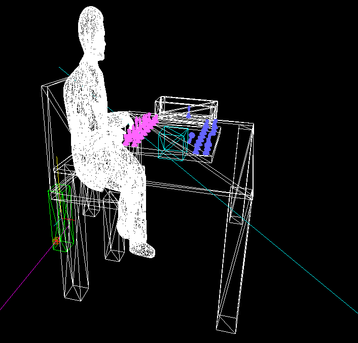

# chess_scene

Created a chess scene with QT and OpenGL during the computer graphics 1 course. Focusing on the computer graphics pipeline and rendering a scene with geometric objects - polygons.

Runs on Ubuntu 20.04. The GPU has to support OpenGL 3.3.

Run Manual:

- following packets need to be installed
  - g++
  - libglm-dev
  - qt5-default (optional)
  - qtcreator (optional)
- Commands typed in terminal
  - make clean
  - qmake
  - make
  - ./CgViewer

Controls:

- plus: zoom in
- minus: zoom out
- left click and move mouse: move scene
- q: select objects
- w: unselect objects
- e: select group

Objects can be transformed when selected

- Controls:

- First choose transformation mode, only one can be selected:
  - t: translate
  - s: scale
  - r: rotate
- Choose which axis, will be toggled off on multiple presses
  - x
  - y
  - z
- Choose effect
  - plus
  - minus

A right click in the scene will create a picking ray. All Intersections with the objects will be marked with a red cube. In Addition, all AABB-Boxes of the objects will be marked with a green cube.

- a: show AABB-Box of selected object

The blue object in the center is the object in object coordinates placed in the scene and the blue ray projected from the scene (in world coordinates) to the object coordinates of the selected object.
